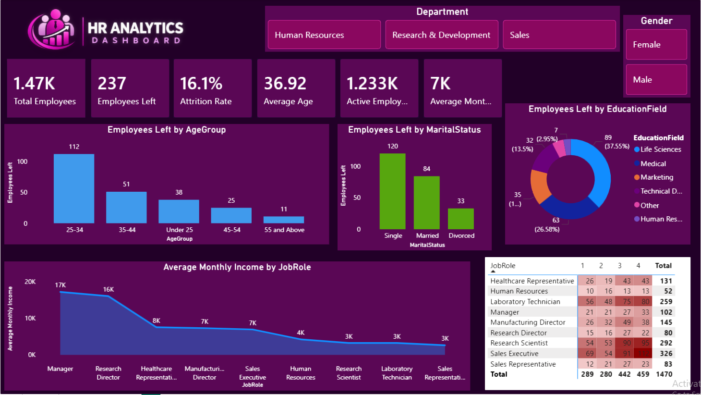

# HR Analytics Dashboard

## 📊 Project Overview

The HR Analytics Dashboard is an interactive data visualization project created using Microsoft Power BI. The dashboard provides insights into employee demographics, attrition, job roles, satisfaction, and income.

## 🎯 Project Objectives

- Analyze employee attrition and active employees
- Understand employee demographics
- Analyze attrition by age group, marital status, and education field
- Compare employee satisfaction across different job roles
- Analyze average monthly income by job role
- Present HR information through an interactive dashboard

## 🛠️ Tools & Technologies

- Microsoft Power BI
- Power Query
- DAX
- Microsoft Excel
- Data Visualization

## 📈 Dashboard Features

- Total Employees
- Employees Left
- Attrition Rate
- Average Age
- Active Employees
- Average Monthly Income
- Department Filter
- Gender Filter
- Employees Left by Age Group
- Employees Left by Marital Status
- Employees Left by Education Field
- Average Monthly Income by Job Role
- Job Satisfaction Analysis

## 🖼️ Dashboard Preview

## 📂 Project Files

- `HR_Analytics_Dashboard.pbix` – Power BI dashboard file
- `HR_Analytics_Dashboard.png` – Dashboard preview image
- `README.md` – Project documentation

## 📌 Key Insights

The dashboard helps analyze workforce trends and provides a visual overview of employee attrition, demographics, job satisfaction, and income.

## 🚀 How to Use

1. Download the `HR_Analytics_Dashboard.pbix` file.
2. Open it using Microsoft Power BI Desktop.
3. Explore the dashboard using the available filters and visualizations.

## 👩‍💻 Project

HR Analytics Dashboard created using Microsoft Power BI.
